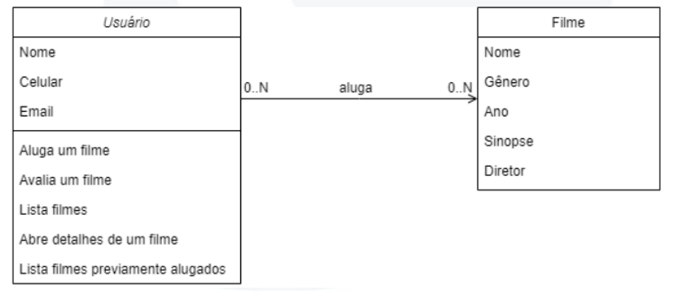

# FILMESTOP.COM - BACKEND

### Objetivo:
Desenvolvimento de uma API REST com foco no usuário e sua interação com o catalogo de filmes, visando resolver as necessidade dos clientes. O servidor pode ser executado com um desses comandos:
```fastapi dev main.py```
ou 
```uvicorn main:app``` 

### Funcionalidades:
 - Listar filmes disponíveis por gênero.
 - Listar todas as informações de um determinado filme.
 - Alugar um filme.
 - Atribuir nota a filme alugado (de 1 à 5).
 - Visualizar todos os filmes que ja alugou.


### Endpoints:
```/docs```
endpoint de acesso ao swagger/documentação para o frontend.

```/user/register-user```
endpoint criada para registrar o usuário, visando a utilização das funções que o usuario pode fazer.

```/user/listar-filmes```
endpoint que retorna o nome de todos os filmes disponível na tabela Filmes.

```/user/listar-genero/{genero}```
endpoint que retorna o nome de todos os filmes disponível na tabela Filmes filtrados por gênero.

```/user/filme/{titulo}```
endpoint que retorna as todas as informações de um filme específico.

```/user/alugar-filme```
endpoint para o usuário realizar a função de alugar filme.

```/user/avaliar-filme```
endpoint onde o usuario pode avaliar um filme alugado.

```/user/filmes-alugados/{cliente_email}```
endpoint responsavel por retornar os filmes alugados pelo usuario e a nota que o usuario atribuiu.


 ### Diagrama de Classes:
 


 ### STATUS
 - Concluído

 ### Tecnologias
 - python/FastAPI